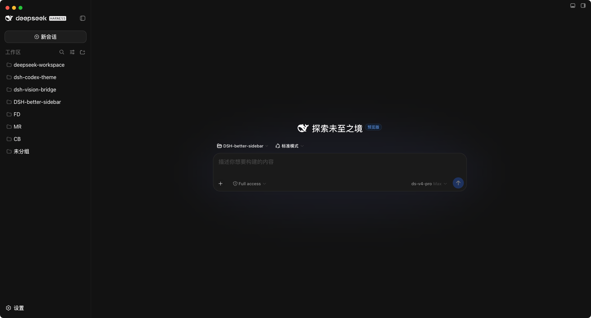
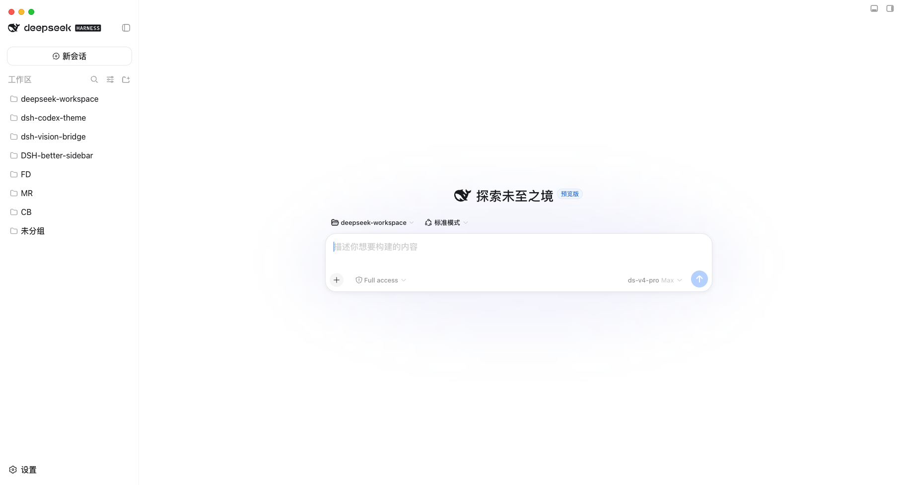

# dsh-codex-theme

English | [中文](README.md)

A Codex theme appearance plugin for DeepSeek Harness (DSH): turns the Codex theme configuration (`codex-theme-v1`, 80 light/dark themes) into a switchable, customizable appearance plugin for DSH.

## Features

- **80 theme presets**: 26 light + 54 dark, Codex colors by default (light accent `#339CFF` / dark accent `#0169CC`).
- **Settings → Codex Theme**: pick a light or dark theme preset right from the DSH settings page (each preset shows a 6-swatch color preview); changes apply instantly.
- **Font & size customization**: set the UI font/size and code font/size independently; the font dropdown only lists fonts actually installed on your machine, and "System default" leaves the native DSH look untouched.
- **Persistence**: all settings are written to `$DSH_HOME/settings.yaml` and survive DSH restarts.
- **Opt out anytime**: disable or uninstall the plugin under DSH Settings → Plugin Management to return to the native DSH appearance.

## Screenshots

**Dark theme (Codex default)**



**Light theme (Codex default)**



## How It Works

This is a DSH two-half plugin (host + client):

- **Host half** (`lib/index.js`):
  1. Registers the `dsh-codex-theme` settings namespace (persisted to `$DSH_HOME/settings.yaml`);
  2. Registers an installed-font enumeration route (`/api/dsh-codex-theme/fonts`) that the appearance panel uses to filter the font dropdown to fonts actually installed on the machine.
- **Client half** (`lib/client.js`): injects the "Codex Theme" panel into the settings page and maps the selected preset onto DSH's `--dsw-*` theme tokens via `theme.overrideTokens`:
  - `surface` → background surface tokens, `ink` → text tokens, `accent` → brand/button/highlight tokens, `contrast` → tiered derivation of secondary text and borders, diff and skill colors → the matching semantic state tokens;
  - the override layer applies per light/dark appearance, is independent of DSH's built-in theme preference, is unaffected by settings sync/reconnect fallbacks, and reacts instantly to the three-way appearance switch.

The preset table `src/client/presets.ts` is generated by `scripts/build-presets.mjs` from the Codex theme configuration (a VS Code-style `colors`/`tokenColors` manifest). It is committed, so builds do not depend on external files; regenerate with `node scripts/build-presets.mjs [path/to/codex-themes.json]`.

## Supported Platforms

The plugin targets the DSH Web GUI and runs wherever DSH runs — **both macOS and Windows are supported**:

- Themes, fonts, and settings persistence are entirely OS-independent and behave identically on both platforms;
- font auto-detection is most complete on macOS (the host enumerates installed fonts via `system_profiler`, cached for 10 minutes); on other platforms it degrades gracefully and the font dropdown shows all candidate fonts.

## Installation

> Requires Node.js ≥ 20 and a working DSH installation (the `dsh` command).

### Option 1: One-click install

Run this in the DSH Desktop built-in terminal (or any terminal with the DSH CLI):

```bash
# once published to the npm registry
dsh plugin add dsh-codex-theme

# or install straight from GitHub (no npm publish needed)
dsh plugin add github:Lxd-Ashe/dsh-codex-theme
```

> When using the standalone dsh CLI without a default profile configured, specify it explicitly: `dsh plugin --profile <profile-name> add ...`.

Restart DSH (the Desktop app or `dsh web`) for the plugin to take effect.

### Option 2: Build from source

```bash
git clone https://github.com/Lxd-Ashe/dsh-codex-theme.git
cd dsh-codex-theme
pnpm install
pnpm run build          # produces lib/index.js (host) and lib/client.js (client bundle)

# install into your profile as a local link
dsh plugin add link:/absolute/path/to/dsh-codex-theme
# with the standalone dsh CLI, specify the profile explicitly:
#   dsh plugin --profile <profile-name> add link:/absolute/path/to/dsh-codex-theme
```

Restart DSH (the Desktop app or `dsh web`) for the plugin to take effect.

### Uninstall

```bash
dsh plugin remove dsh-codex-theme
```

You can also disable or uninstall the plugin under DSH Settings → Plugin Management.

## Build

```bash
pnpm install
pnpm run build       # produces lib/index.js and lib/client.js
pnpm run typecheck   # type check
```

## Project Layout

```
├── lib/                      # build output (host + client)
├── docs/                     # screenshots (dark / light theme)
├── scripts/build-presets.mjs # generates the preset table from the Codex theme config
├── src/
│   ├── index.ts              # host: settings namespace + font enumeration route
│   ├── fonts-route.ts        # installed-font enumeration (macOS system_profiler)
│   ├── settings-schema.ts    # settings schema
│   └── client/               # client: theme panel and token derivation
├── dsh.plugin.json           # DSH plugin manifest
├── cordis.patch.yml          # bundle patch: mounts the plugin row
└── build.mjs                 # esbuild build script
```

## License

This project is licensed under the [MIT](LICENSE) open source license.
